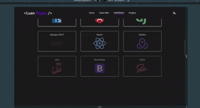

# Site de Portfólio Pessoal

Este projeto foi desenvolvido por mim com o objetivo de apresentar minhas habilidades e trabalhos no mundo da programação, em um site com design elegante e navegação intuitiva. A primeira versão foi criada em agosto de 2023, antes de eu adquirir minha primeira experiência profissional na área. Agora, cerca de um ano e meio depois, decidi revisitar o projeto para aprimorá-lo com os conhecimentos que adquiri ao longo desse tempo. O resultado final está disponível em: https://portfolio-luanpoppe-frontend.vercel.app/.

## Stack utilizada

**Front-end:**:
- **React + Vite**: Escolhido pela agilidade no desenvolvimento desde o início do projeto, além da facilidade de publicação.
- **TypeScript**: Adotado para trazer maior segurança e produtividade ao desenvolvimento, com tipagens específicas alinhadas às necessidades do projeto.
- **Context API**: Utilizado para simplificar a gestão de estado entre diferentes componentes, garantindo consistência e eficiência.
- **Bootstrap + React-Bootstrap**: Implementado para aproveitar soluções prontas e otimizadas que agilizam o desenvolvimento de interfaces modernas e responsivas.
- **React-Icons**: Ferramenta prática para integrar ícones diretamente como componentes React, facilitando a personalização e o uso.


## Demonstração


## Rodando localmente

Crie uma pasta onde o projeto irá ficar

Acesse a pasta em questão pelo terminal e clone o projeto com o seguinte comando:
```bash
  git clone https://github.com/luanpoppe/portfolio_luanpoppe .
```

Instale as dependências
```bash
  npm install
```

Inicialize o projeto

```bash
  npm run dev
```


## Funcionalidades
- Totalmente responsivo, adaptando-se a diferentes tamanhos de tela
- Navegação prática com seções acessíveis através do menu
- Animações simples, mas eficazes, para aprimorar a experiência do usuário
- Uso de modais para exibir informações detalhadas sobre projetos específicos
- Possibilidade de escolha da língua do site em inglês ou português


## Melhorias
- Adicionar opção de tema dark e light
- Adicionar um filtro de projetos por tema/linguagem/framework.